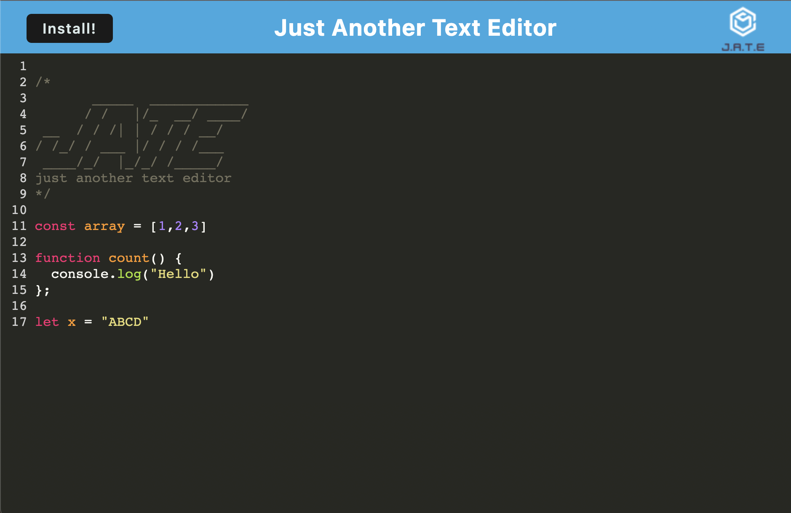

# Text-Editor

## Description
This is a text editor application that run in the browser and can be installed on your computer. It is designed based on progressive web application criteria, and is able to function offline. It stores the data to an IndexedDb database which is in the browser.

## Table of Contents
* [Screenshot](#Screenshot)
* [Link](#Link)
* [Installation](#Installation)
* [License](#License)
* [Questions](#Questions)
 
## Screenshot

## Link
[Deployed Application at Heroku](https://agile-atoll-94244.herokuapp.com/)

## Installation
In order to install the application to your local machine, click the install button at the top left side of the nav bar and follow the prompt.
## License
This Application is covered under MITLicense

For more information about the License visit [MIT License Page](https://choosealicense.com/licenses/mit/)
## Questions
For further questions please contact me at:

GitHub: [https://github.com/hekmatsalehi](https://github.com/hekmatsalehi)

Email: [hekmatullahsalehi@gmail.com](mailto:hekmatullahsalehi@gmail.com)